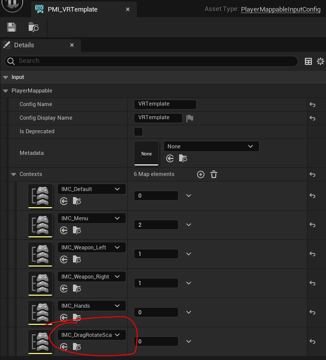
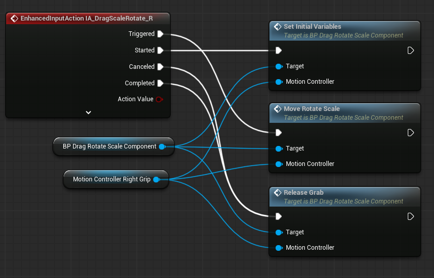

# VR Drag Locomotion Move/Rotate/Scale

Unreal Engine Virtual Reality Drag Locomotion. Using a Grip/Grab Input: Move, Rotate, Scale your VR Pawn.

Latest Tested: 5.3.2 uelauncher
## Demo
[quick demonstration on YouTube](https://youtu.be/P7NQBMlyEJs):

... [link to earlier version](https://youtu.be/nO2tA2GukM4) (with a buggy scale function)

## Context

This blueprint code allows users to move their VR character by grabbing and pulling in the x, y, and z directions, as well as rotating around the Z-axis and scaling the pawn by moving the controllers together or apart.

Currently has Z-axis Yaw rotation (rotate self in a circle around pivot), x/y/z grab/pull movement. There is no X-axis Roll rotation or Y-axis Pitch rotation, though Pitch might be added as an expanded comfort setting.

This is a comfortable way to move in smaller roomscale VR experiences,  and is similar to the locomotion used in Unreal Engine's built-in VR Editor, TiltBrush (Unity), and Demeo (Unity). Oculus had a version of this in their locomotion samples [GrabAndDrag](https://developer.oculus.com/documentation/unreal/unreal-samples/) - though last I looked it ran on tick and didn't handle rotation.

Development insight was gained from [this forum thread](https://forums.unrealengine.com/t/using-controllers-to-scale-rotate-re-position-world/74892/12), though much of the og post has missing images the conversation was useful for someone interested in the mechanics. I also took inspiration from early VR climbing mechanics, expanding the range of motion for full 360 movement. AxisOfMovement is not currently a runtime variable, but if you wanted to limit the drag motion to x/y/z plane, you could easily enough with some slight tweaking to the component BP (e.g. prevent users from climbing into the sky or down below your level, or lock movement to different planes at runtime to enforce scene logic - in a well/passageway with limited movement). I might add this later.

This took me a substantial amount of time to get working properly for my own project. I'm sharing this with the community because I've really appreciated it when other developers shared their work in forums and YouTube videos. If you do end up using this in your own projects, please let me know, I'd love to know if it's been helpful for other creators.

If you have any questions, reach out.
[kavanbahrami.com](https://kavanbahrami.com/)

## Getting Started

Add DragRotateScale locomotion to the default VR template.

### Files
- DragRotateScale ActorComponent
- Left InputAction
- Right InputAction
- InputMappingContext (IMC)

### Setup

1. Unzip and Copy the "VRDragLocomotion" folder into your project's "Content" directory

2. Open your project

3. Either: 
  
  - Update your current InputMappingContext (e.g. IMC_Default) to reference the included L/R InputActions. You can use the included InputMappingContext as an example reference
  - IMC_Default can be located in "VRTemplate > Input > "
  
  or
  
  - Call AddMappingContext on your VRPawn and add the included IMC. Set "Priority: 1" to prevent the default mapping from consuming your inputs.
  - Update your PlayerMappableInputConfig to reference the included InputMappingContext. _I saw that this was potentially going to be deprecated, but as of 5.3.2 it's still there and being used._

4. Add the DragRotateScaleActorComponent to your VRPawn

5. On your pawn's BeginPlay, call SetComponentVariables and provide references from your pawn's Components

6. Within your VRPawn's event graph, add the EnhancedActionEvent for the included L/R InputActions. Call the following functions from the now attached BP_DragRotateScaleComponent, passing them the appropriate L or R motion controller
- from Started, call SetInitialVariables
- from Triggered, call MoveRotateScale
- from Canceled and Completed, call ReleaseGrab

7. Update the default settings on the BP_DragRotateScaleComponent, Min/Max Scale, etc...

8. Update the InputMappingContext with the desired input mapping, defaults are set for a few systems

### Usage

Play in VR preview or build to HMD. Use the set input action (defaults to grips + triggers) to move your VRPawn around the scene. Input from single InputAction to grab/drag/pull your pawn around. Use both InputActions simultaneously and rotate controllers around each other to rotate your VRPawn around. While holding both InputActions, pull MotionControllers together or apart, to adjust the world scale.

## Known Issues

- By Default, the Grip and Trigger buttons are used for grabbing objects and shooting the gun. This since we are also using Grip/Trigger for locomotion, there will be input overlap. Adjust your game input accordingly for your project.

- Sometimes there are backwards compatibility issues with uassets. These assets were last updated in 5.3.2. If you're using an older engine version and the Input Actions are 'broken' you'll have to manually remake and assign them, which isn't too difficult, but also isn't ideal.

## Archive Versions

The previous versions had the functionality within included VRPawn blueprints. These are still available in the archive zip. The functionality was moved to a more modular ActorComponent for the latest BP version. At some point I'll get around to uploading the C++ version as well.

### Unreal 4 / Archive Setup

- If you're using Unreal Engine versions prior to 5.1, you'll need to enable the "Enhanced Input" plugin and update your project settings to use it.
	- Edit > Plugins > Enable "Enhanced Input" Plugin + Restart Now
	- Edit > Project Settings >
	- Change the Default Player Input Class to "Enhanced"
	- Change the Default Input Component Class to "Enhanced"

- In the "VRTemplateMap", go to "World Settings" and override the "Default Pawn Class" under "Selected GameMode" with either "VRPawn_ue4" or "VRPawn_ue51", depending on your UE version.

- Turn "Consume Input" OFF on the current two default Grab InputActions, "IA_Grab_Left" and "IA_Grab_Right".
	- The default Grab InputActions can be located in "VRTemplate > Input > Actions > "
	- Double click them and turn off the check box, on by default.